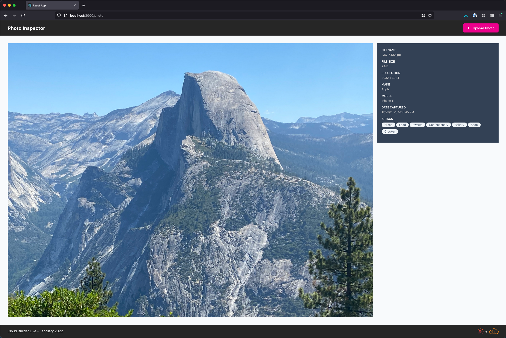

# Cloud Builder Live - March 2022

In this episode of Cloud Builder Live we will be using the [AWS CDK (Cloud Development Kit)](https://aws.amazon.com/cdk/) to deploy a web application, create a REST API, and then continuous deploy the entire thing from a GitHub repository.  



## Watch it Live

This episode will air on March 15, 2022 at 6pm Eastern time.  It will be streamed on both [YouTube](https://www.youtube.com/watch?v=jBXWhKKq40c) and Twitch.  

## Finished Version

You can find the version from the live demo under the [finish branch](https://github.com/ACloudGuru-Resources/community-cbl-mar2022/tree/finish).

## Prerequisites

To follow along with this episode, you will need to have the following elements in place:

1. **AWS Account** - this will require that you have an AWS account that you can leverage. If you haven't created one, you can [follow the instructions here](https://aws.amazon.com/premiumsupport/knowledge-center/create-and-activate-aws-account/). 
2. **Node.js** - you will need to have Node.js installed.  If you don't have it installed, you can [follow the instructions for it here](https://nodejs.org/en/download/).

## Getting Started

To run the application in its initial state, you can clone the repository and then run the following commands locally:

```bash
yarn
cd webapp
yarn start
```

## Client-Side App

The creation of the React app won't be covered in this episode.  At a high level, this is a React app that leverages, [hooks](https://reactjs.org/docs/hooks-intro.html), [Tailwind CSS](https://tailwindcss.com), and the [React router](https://reactrouter.com/).
